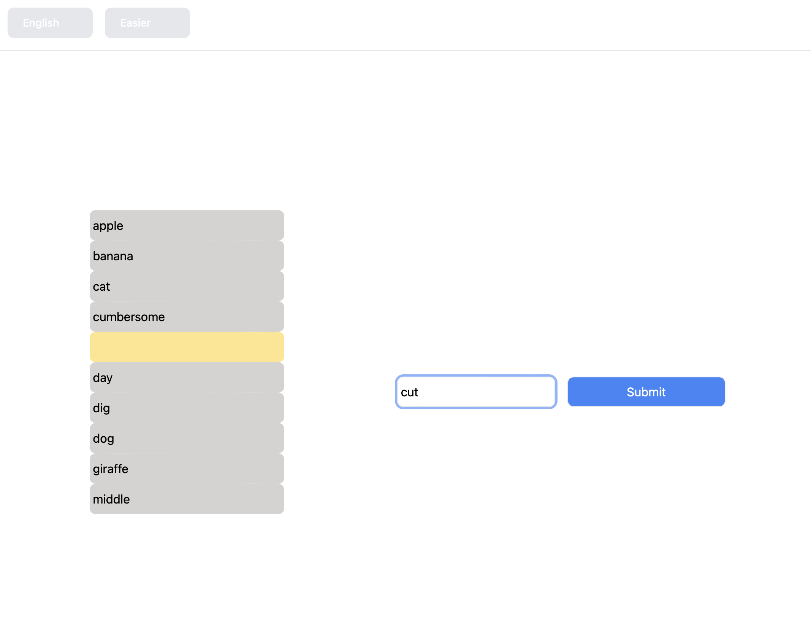

# Word searching with a smidge of cheating

A word-guessing game that sometimes cheats, written in vanilla HTML/JS, and using tailwind for styling

## Set up

(Recommended) start up a virtual env by running, .e.g. (if you have virtualenv installed)
  
    python3 -m venv venv
    source venv/bin/activate

and install dependencies with

    yarn install

## Playing the game

Start the server by running

    yarn start

and navigate to localhost:3000 in a browser.  You will be prompted to enter a word, and its
position will tell you whether your word is before or after the correct word in the alphabet.

Bonus feature (definitely not a bug) is that if your guesses skew too much before or too much after
the secret word, any relevant information for guessing leaves the screen and you no longer have 
any idea what is going on.

This is what it looks like to be playing:

Features three modes (Easier/Harder/Impossible) and two languages (English/German)